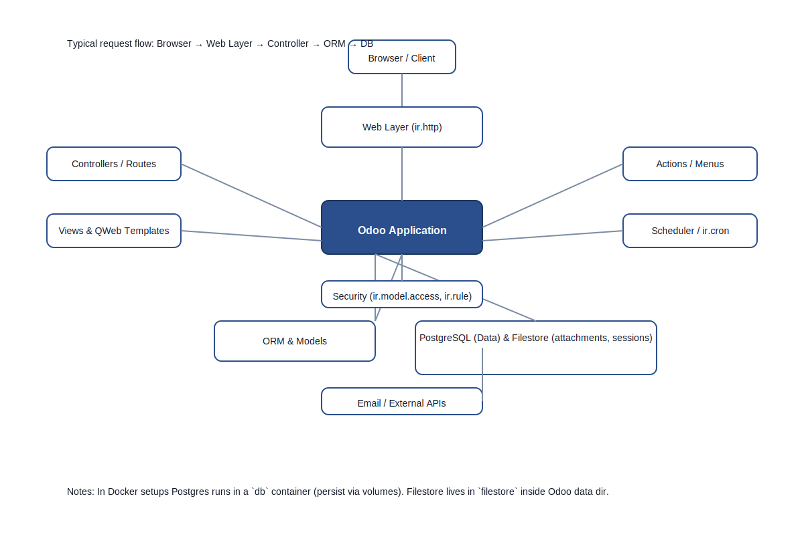

# Project 1 Implementation Guide

This document explains how to install, test, and extend the `task_management` module in your local Odoo development environment.

Prerequisites
- A running Odoo instance (Docker or local)
- Module placed in `addons/` folder (this workspace already contains it)

Install steps
1. Restart Odoo or your Docker containers:

```bash
# from project root
docker compose down -v
docker compose up -d
```

2. Open Odoo at `http://localhost:8070` (or your configured port)
3. Activate developer mode: Settings -> Activate the developer mode
4. Apps -> Update Apps List -> Search for "Task Management" -> Install

Basic testing
- Create categories: Task Management -> Categories -> Create
- Create tasks: Task Management -> Tasks -> Create
- Use header buttons to move between states

Extend ideas
- Add Kanban view and drag-and-drop
- Add automated reminders for overdue tasks (cron)
- Add task comments (mail.thread) and followers
- Add tests (unit tests using Odoo test framework)

Troubleshooting
- If module not visible: ensure `addons` is included in `addons_path` and restart Odoo
- Check logs for import errors

Next steps
- After you confirm the module runs, we will add unit tests and a Kanban view, then prepare the GitHub repository and README for portfolio submission.

## Overview: databases, sessions and how Odoo works (mind map)

Why you had to login and re-select a database
- Odoo is a multi-database application. The web UI needs to know which database to work with before you can log in. The login page either shows a database selector (if multiple DBs exist) or redirects to the database manager.
- If you see "Select database" or "Manage databases" it means Odoo is running but has not loaded a specific DB session for you. You must either pick an existing DB or create a new one.
- Sessions are ephemeral (stored in the filestore or filesystem inside the container). If sessions are cleared or the container was restarted with a clean filestore, you'll need to log in again.

Where the stored database lives (Docker setup)
- In this project the PostgreSQL server runs in the `db` container. The actual data is inside the PostgreSQL data directory in the container, usually mapped to a Docker volume or host folder.
- To list databases from the project root run (in this repo):

```bash
docker compose exec db psql -U odoo -c "\\l"
```

- To inspect Docker volumes:

```bash
docker volume ls
docker volume inspect <volume_name>
```

- If you want the DB to persist on the host, map a host directory to the Postgres `PGDATA` in `docker-compose.yml` (example: `./pgdata:/var/lib/postgresql/data/pgdata`).

Quick checks to find an existing DB and login again
- Check DB list as shown above.
- If your DB exists, open Odoo and choose that DB in the selector; then log in with your user/password.
- If the DB is not present, it may be in a different Docker composition or removed; check other Docker stacks or backups.

High-level mind map — how Odoo works (textual)

- Client (Browser)
	- Sends HTTP requests to Odoo web server (static files, RPCs, form submissions)

- Web server layer
	- Werkzeug / Odoo HTTP layer -> `ir.http`
	- Static file serving (QWeb assets), session handling

- Routing / Controllers
	- Controllers handle custom HTTP routes and JSON-RPC endpoints
	- Web client calls RPC endpoints for actions, views, and model methods

- ORM & models
	- Models are Python classes (models.Model) backed by PostgreSQL tables
	- Fields map to DB columns (Char, Integer, Many2one, One2many, Many2many)
	- ORM handles SQL generation, constraints, and cascades

- Registry & module loading
	- At startup Odoo builds the registry of models from installed modules
	- `__manifest__` (module metadata) describes version, dependencies, data files

- Views & UI
	- XML views (form/tree/kanban) define how models are presented
	- Templates (QWeb) render HTML for the front-end
	- JS widgets provide interactivity (kanban drag/drop, avatars)

- Security
	- `ir.model.access` rules (CSV) define CRUD permissions
	- Record rules (ir.rule) apply domain-based access control
	- Groups and users determine UI visibility

- Actions, Menus and Reports
	- `ir.actions.act_window` opens views; `ir.actions.report` defines reports
	- Menus link to actions

- Scheduler & background jobs
	- `ir.cron` executes periodic jobs (mail reminders, cleanup tasks)

- Filestore / attachments
	- Binary file content (attachments, session files) stored on filesystem (filestore)

- Email & external integrations
	- Outgoing mail (SMTP) and incoming mail gateway
	- External APIs called from controllers or cron jobs

- Lifecycle flow for a typical web request
	1. Browser -> HTTP request -> Odoo `ir.http`
	2. Static request handled or controller invoked
	3. Controller calls model methods or ORM
	4. ORM translates to SQL and hits PostgreSQL
	5. Result returned to controller -> rendered (QWeb) or JSON returned

Which elements you should study next (for Project 1)
- Models & fields (create, search, write, unlink)
- Views (form/tree/kanban) and the new Odoo 17 view attributes (use `invisible` instead of `states`)
- Menus, actions and access control (`ir.actions.act_window`, `ir.model.access.csv`)
- Simple server actions (cron) for automated reminders
- Filestore basics (where attachments/sessions are stored)

Add this overview to your Project 1 README as a quick reference for interviews and future extension work.

### Visual Mind Map

Refer to the visual mind map for a quick overview of the main Odoo components and how they connect.



Tip: open `docs/odoo_mindmap.svg` in your browser or any image viewer. The file is SVG so it scales cleanly for presentations.

## Next goals & learning outcomes

Planned next steps (short-term)
- Add unit tests for `task.task` methods to validate state transitions and basic ORM operations.
- Improve demo data: assign example tasks to an existing admin user when present, and add more realistic due dates.
- Add a PNG export of the mind map for the repository README.
- Add a simple CI workflow (GitHub Actions) that installs Odoo, mounts the module, and runs unit tests.

Learning outcomes you should expect
- Understand Odoo module anatomy: manifests, models, views, security, data files.
- Use the ORM: create, search, write, unlink, and work with relational fields (Many2one, One2many).
- Build and customize views (form, tree, kanban) and understand view attributes in Odoo 17 (use `invisible` instead of `states`).
- Debug modules using logs and container shells (`docker compose exec web bash`).
- Manage persistence and backups: Postgres dumps, filestore backup, Docker volume handling.

How we'll verify progress
- Green unit tests for the task module (state transitions).
- Demo data loads successfully on install and shows sample records.
- CI pipeline runs tests and reports success on GitHub.

Marking progress
- I've fixed the Cancel button behavior so unsaved forms can be discarded without forcing required-field validation.

If you agree with these goals, I'll add unit tests and a basic GitHub Actions workflow next.
